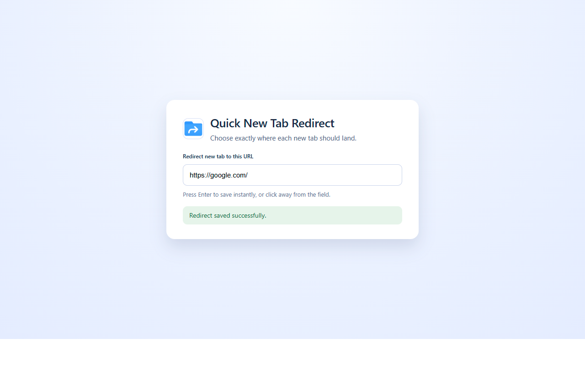

# 🚀 Quick New Tab Redirect

**Quick New Tab Redirect** is a fast, lightweight Chrome extension that lets you **instantly redirect your New Tab page** to **any URL of your choice** — whether it's Google, your task manager, personal dashboard, or even a local HTML file.

🧭 **Fast. Simple. Focused.**  
No bloat. Just open a new tab and land exactly where you want.

---

## 🌟 Features

- 🔗 Set any custom URL to load in new tabs
- ⚡ Super fast and minimal — no unnecessary permissions
- 🛠️ Clean options panel to update your URL
- 💾 Saves your settings using Chrome's syncable storage
- 🌍 Fully localized in 18+ languages
- 🧠 Open-source and privacy-focused

---

## 📸 Screenshots

| Options Page |
|--------------|
|  
> *(You can replace the above image paths with your actual screenshots in the `/screenshots/` folder)*

---

## 🔧 Setup & Installation

### From Chrome Web Store  
👉 [Install from Chrome Web Store](https://chrome.google.com/webstore/detail/quick-new-tab-redirect/your-extension-id)

### From Source

1. Clone the repo  
   ```bash
   git clone https://github.com/quant-gpt/quick_new_tab_redirect.git
